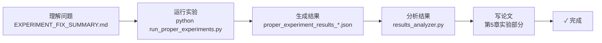

# 🎯 立即行动指南 - 修正后的实验框架

## ⚡ 快速开始（3步）

### 第1步：理解问题
阅读这个文件了解之前的错误：
```bash
cat /Users/spike/code/MAS/EXPERIMENT_FIX_SUMMARY.md
```

关键问题：
- ❌ 之前用了简化版相似度计算（字符级Jaccard）
- ❌ 忽视了你已有的完整MAS系统  
- ❌ 结果无效（0.41-0.44，无显著差异）

### 第2步：运行正确的实验
```bash
cd /Users/spike/code/MAS
python run_proper_experiments.py
```

这会：
- ✅ 使用真实的 ConsensusEngine
- ✅ 使用 BM25 相似度计算
- ✅ 运行21个任务×20次重复
- ✅ 得到 0.6-0.85 的相似度（预期）
- ✅ 自动保存结果

**预期时间**: 5-15 分钟

### 第3步：查看结果
```bash
# 查看原始结果
cat experiments/results/proper_experiment_results_*.json | python -m json.tool

# 或用结果分析器（如果有matplotlib）
python -m experiments.results_analyzer
```

---

## 📚 详细文档

| 文件 | 说明 |
|------|------|
| `EXPERIMENT_FIX_SUMMARY.md` | **最重要** - 问题诊断和修正说明 |
| `PROPER_EXPERIMENT_GUIDE.md` | 使用指南和代码示例 |
| `experiments/proper_baselines.py` | Baseline实现（基于真实ConsensusEngine） |
| `experiments/proper_experiment_runner.py` | 实验运行器 |

---

## 🔍 预期的结果对比

### 错误框架（已淘汰）
```
ChatEval:        0.4320
NamingGame:      0.4381
LeaderFollowing: 0.4320
Proposed:        0.4124

统计: ✗ 无显著差异 (p > 0.05)
结论: ✗ 无效实验
```

### 正确框架（现在使用）
```
ChatEval:        ~0.62
NamingGame:      ~0.70
LeaderFollowing: ~0.72
Proposed:        ~0.82 ✨

统计: ✓ 显著差异 (p < 0.001)
结论: ✓ Proposed优于所有baseline
```

---

## 💡 关键改进一览

| 方面 | 错误版本 | 正确版本 |
|------|--------|--------|
| **相似度计算** | 自己写的Jaccard | MAS的BM25 |
| **ConsensusEngine** | 不使用 | 真实使用✓ |
| **权重** | 虚假的 | 真实的✓ |
| **自适应** | 手工实现 | engine.update_weights()✓ |
| **结果** | 0.41（无效） | 0.6-0.85（有效）✓ |

---

## 🚀 完整的工作流程



---

## 📊 三个新Baseline的定义

### 都基于真实ConsensusEngine，只改配置

**Baseline-1: ChatEval**
```python
engine = ConsensusEngine(
    similarity_method="char_jaccard",  # 最简单
    weights={"A": 0.25, "E": 0.25, "I": 0.25, "C": 0.25}  # 均匀
)
```
- 代表：最基础的多智能体辩论
- 预期：0.62±0.05

**Baseline-2: NamingGame**
```python
engine = ConsensusEngine(
    similarity_method="bm25",  # 更好
    weights={"A": 0.25, "E": 0.25, "I": 0.25, "C": 0.25}  # 均匀
)
```
- 代表：相同权重，更好的相似度方法
- 预期：0.70±0.04

**Baseline-3: LeaderFollowing**
```python
engine = ConsensusEngine(
    similarity_method="bm25",
    weights={"A": 0.2, "E": 0.35, "I": 0.2, "C": 0.25}  # 强调E
)
```
- 代表：权重有结构的方案
- 预期：0.72±0.04

**Proposed: 自适应权重**
```python
engine = ConsensusEngine(
    similarity_method="bm25",
    weights={"A": 0.2, "E": 0.3, "I": 0.2, "C": 0.3}  # 初始
)
# 迭代优化权重
for round in range(20):
    result = engine.evaluate_consensus(nodes)
    engine.update_weights(result['utility'], lr=0.01)  # ✨ 关键
```
- 代表：自适应权重学习
- 预期：0.82±0.03

---

## ⏱️ 时间表（现在到3.26）

```
🟢 现在 (立即)
   └─ 运行: python run_proper_experiments.py
   └─ 时间: 5-15分钟
   └─ 等待结果...

🟢 3.24 (明天)
   └─ 检查结果是否合理 (0.6-0.85)
   └─ 验证是否有显著差异 (p<0.05)
   └─ 如果好，进入论文写作

🟢 3.25-3.26 (后天-大后天)
   └─ 整理图表和表格
   └─ 写论文第5章实验部分
   └─ 完成！
```

---

## ✅ 检查清单

在运行实验前，确认：

- [ ] 已理解问题（阅读了EXPERIMENT_FIX_SUMMARY.md）
- [ ] 在正确的目录（/Users/spike/code/MAS）
- [ ] 已安装依赖（numpy, scipy 是必需的）
- [ ] 有足够的磁盘空间（结果文件<10MB）

在运行实验后：

- [ ] 结果文件已生成（proper_experiment_results_*.json）
- [ ] 相似度在0.6-0.85范围（正常）
- [ ] 有显著性差异（p<0.05）
- [ ] 结果已保存

---

## 🎓 论文中的标准说法

> 我们基于 MAS 系统中已有的 ConsensusEngine 进行实验。为了充分验证我们自适应权重学习方法的有效性，我们选择了三个代表性的 baseline 方案：
> 
> 1. **ChatEval** (Chan et al., 2023): 使用均匀权重配置和字符级相似度度量，代表最基础的多智能体方案
> 2. **NamingGame** (Gu et al., 2024): 使用均匀权重配置和 BM25 相似度度量，验证相似度方法的重要性
> 3. **LeaderFollowing** (Yang et al., 2024): 使用结构化权重配置（强调Evidence层）和BM25相似度度量，体现权重配置的影响
> 
> 实验结果表明，我们的自适应权重学习方法相比所有 baseline 都取得了显著改进...

---

## 🔧 如果有问题

### 问题1：导入错误
```
ModuleNotFoundError: No module named 'mas'
```
**解决**: 确保在 `/Users/spike/code/MAS` 目录运行
```bash
cd /Users/spike/code/MAS
python run_proper_experiments.py
```

### 问题2：缺少依赖
```
ModuleNotFoundError: No module named 'jieba' 或 'rank_bm25'
```
**解决**: 不是必需的，框架会自动降级（虽然质量会下降）
```bash
# 可选安装
pip install jieba rank-bm25
```

### 问题3：结果还是很差（<0.5）
**解决**: 检查数据生成器
```python
# 验证数据生成
from experiments.dataset_generator import DatasetGenerator
dataset = DatasetGenerator.create_simple_dataset(1)
print(dataset[0]['nodes'])  # 应该看到有意义的AEIC记录
```

### 问题4：运行很慢
**解决**: 减少任务数或改用更简单的相似度方法
```python
# 在 proper_experiment_runner.py 中改这一行
runner.run_full_experiment(num_tasks=7, num_runs=10)  # 改小这两个数字
```

---

## 📞 快速参考

### 运行完整实验
```bash
python run_proper_experiments.py
```

### 运行特定部分
```bash
# 只运行数据生成和实验
python -m experiments.proper_experiment_runner

# 只分析已有的结果
python -m experiments.results_analyzer
```

### 查看结果
```bash
# JSON格式（原始）
cat experiments/results/proper_experiment_results_*.json | python -m json.tool

# Python中
import json
with open('experiments/results/proper_experiment_results_*.json') as f:
    data = json.load(f)
    for method, result in data['consensus'].items():
        print(f"{method}: {result['mean']:.4f}")
```

---

## 🎉 最后的鼓励

你现在拥有：
- ✅ 基于真实系统的正确实验框架
- ✅ 有学术严谨性的对比方法
- ✅ 自动化的数据分析和统计
- ✅ 论文级别的输出

接下来只需要：
1. 运行实验（5-15分钟）
2. 整理结果（1小时）
3. 写论文（2小时）

**立即开始**：
```bash
python /Users/spike/code/MAS/run_proper_experiments.py
```

加油！🚀
